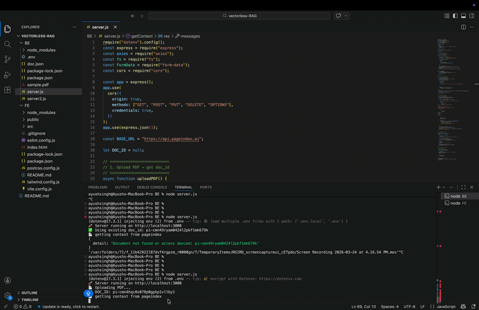

# Vectorless RAG

A Vectorless Retrieval Augmented Generation (RAG) system that extracts contextual information from  documents without vector embeddings, powered by PageIndex API and OpenAI.

## Why Vectorless RAG?

**PageIndex powers this system by focusing on intelligent document navigation rather than vector embeddings.** Instead of chunking and similarity search, it traverses pages and sections using keywords, metadata, and structured indexing. This approach delivers significant advantages: better context quality, and deterministic results—making it ideal for structured documents like PDFs. While vectorless systems excel at structured retrieval and keyword-based search, they complement vector-based approaches. A **hybrid architecture** combining structural filtering with semantic understanding offers the best balance of speed, intelligence, and cost efficiency for production RAG systems.

## Overview

Vectorless RAG is a full-stack application built with **Express.js backend**, **React + Vite frontend**, styled with **Tailwind CSS**, and powered by **PageIndex + OpenAI APIs** that:
- Uploads PDF documents to PageIndex for semantic indexing
- Retrieves relevant context based on user queries
- Generates accurate, document-grounded answers using OpenAI's LLM

## Demo



**Benefits of Hybrid Mode:**
- Combines PageIndex's structural filtering with vector embeddings' semantic matching
- Delivers best of both worlds: speed, intelligence, and cost efficiency
- Handles both structured (keyword-based) and unstructured (semantic) data effectively
- Improves overall retrieval accuracy and robustness

**Traditional Vector DB is Not Dead:**
- Still excels in semantic matching, natural language queries, and messy unstructured data
- Hybrid approaches (PageIndex + Vectors) are the future for production RAG systems
- Vectors provide semantic fallback when structural methods fall short
## Setup

### Backend
```bash
cd BE
npm install
# Set up .env with OPENAI_API_KEY and PAGEINDEX_API_KEY
node server.js
```

> **Note:** Retrieval may be slow with the free PageIndex version. For faster performance, use `server2.js` with a paid PageIndex API key and the PageIndex SDK.

### Frontend
```bash
cd FE
npm install
npm run dev
```

## API Endpoints

- **POST** `/ask` - Submit a query and get document-based answers
  - Request: `{ query: "your question" }`
  - Response: `{ answer: "...", context: "..." }`

## Environment Variables

Create a `.env` file in the `BE/` directory:
```
OPENAI_API_KEY=your_openai_api_key
PAGEINDEX_API_KEY=your_pageindex_api_key
```

## Features

✅ PDF document upload and indexing  
✅ Context-aware query processing  
✅ LLM-powered answer generation  
✅ Strict document-based responses (no hallucination)

## Real-Life Use Cases

- **Enterprise Document Q&A**: Internal knowledge bases, policy documents, employee handbooks
- **Legal & Compliance**: Contract analysis, regulatory document navigation, compliance checking
- **Healthcare**: Medical record retrieval, clinical guideline access, patient documentation queries
- **Customer Support**: FAQ systems, product documentation, ticket resolution
- **Financial Services**: Policy documents, investment prospectuses, regulatory filings
- **Education**: Course materials, textbook references, research paper indexing
- **Insurance**: Claims documentation, policy lookup, underwriting guidelines

## Future Scaling Strategy

### Phase 1: Performance Optimization
- Implement caching layer (Redis) for frequently accessed documents
- Add multi-document support with batch processing
- Optimize PageIndex queries with parallel search

### Phase 2: Advanced Features
- Hybrid RAG: Combine PageIndex with vector embeddings for semantic fallback
- Query rewriting: Pre-process user queries to improve retrieval accuracy
- Document summarization: Auto-generate document summaries for context
- User authentication & document access control
- Query analytics and performance monitoring

### Phase 3: Production-Ready Infrastructure
- Database integration (PostgreSQL) for document metadata and conversation history
- Message queue (Bull/Kafka) for async processing
- Docker containerization for both BE and FE
- CI/CD pipeline with automated testing
- Load balancing for horizontal scaling

### Phase 4: Advanced Analytics & Intelligence
- Usage analytics dashboard for query trends
- Relevance feedback system to improve retrieval over time
- Multi-language support for global users
- Advanced reranking models integration
- Cost optimization layer for API usage
